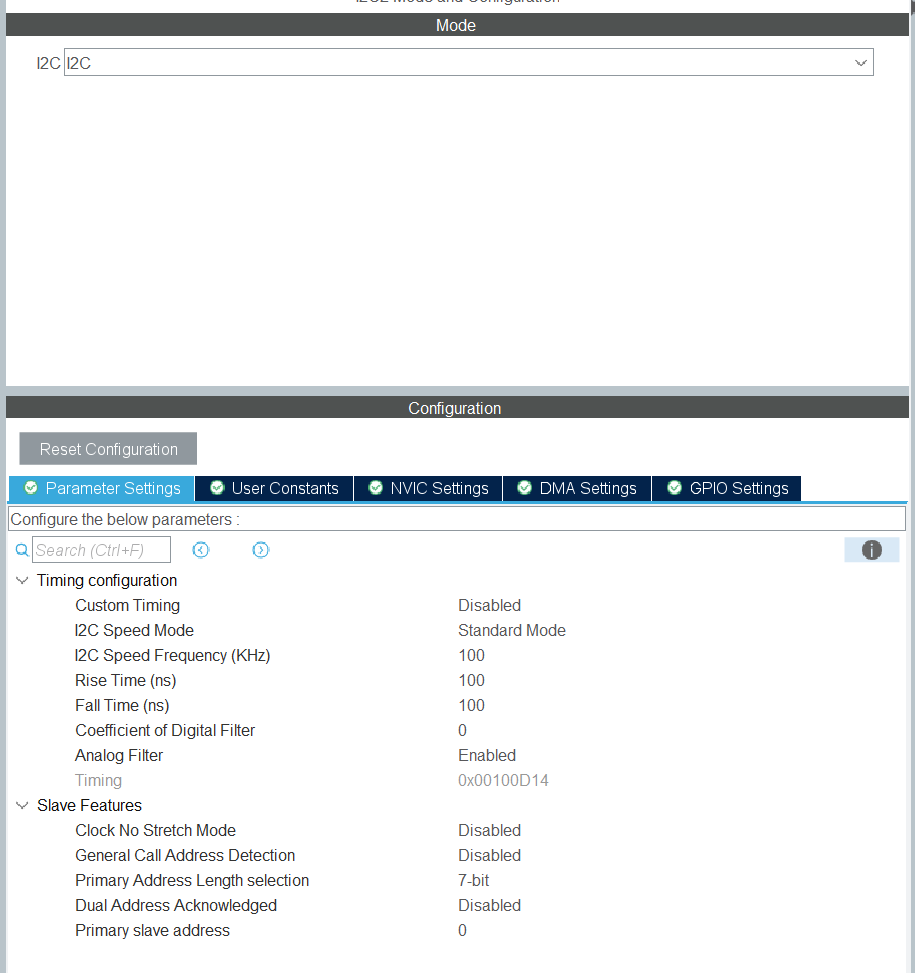
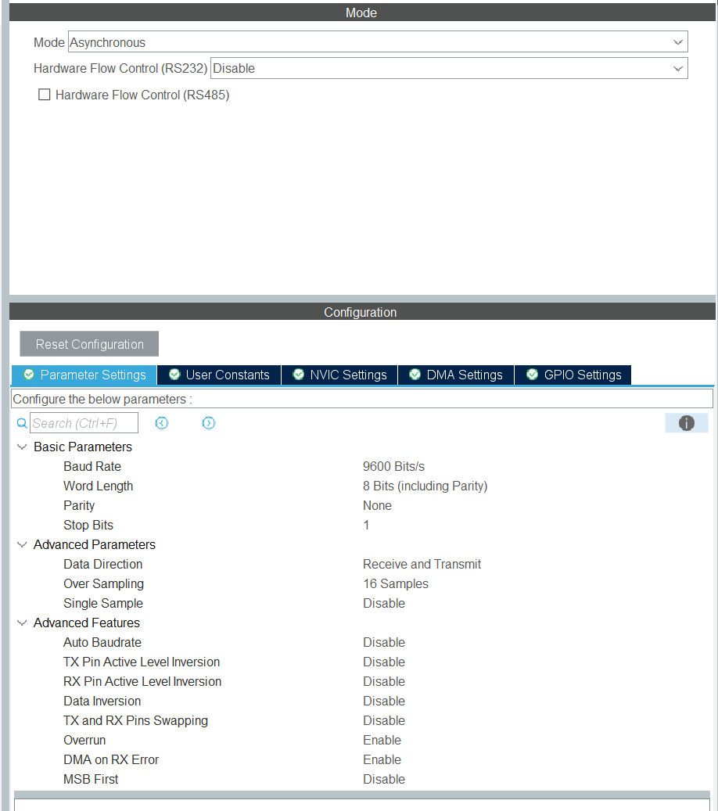
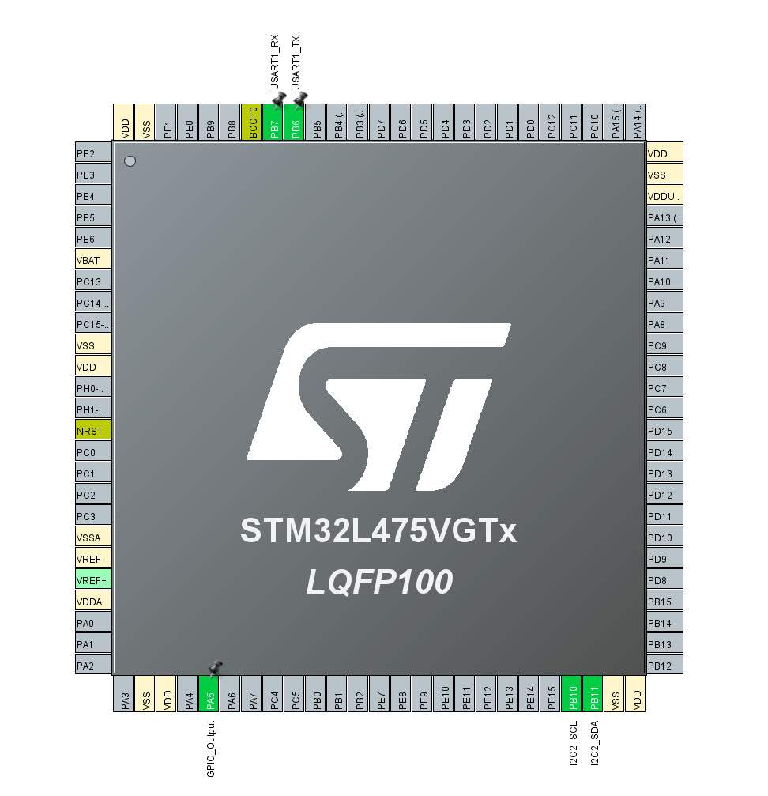

# Reading Sensor Data

In this example, we will read the sensor data using the sensors embedded in the ST board.

We will use I2C for the serial communication and USART to print out the sensor data.

**Configure I2C and USART as follows:**

**The peripherals should look like this:**

In the code we initialize all the sensors and read the sensor data. Calibration was required to get more accurate measurements.
