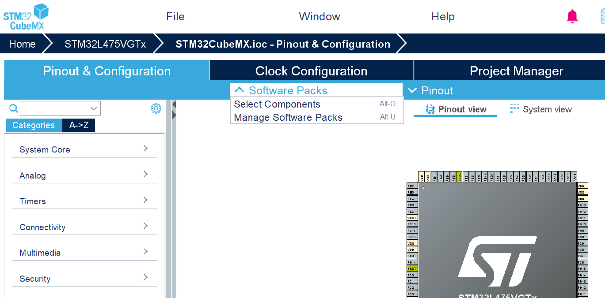
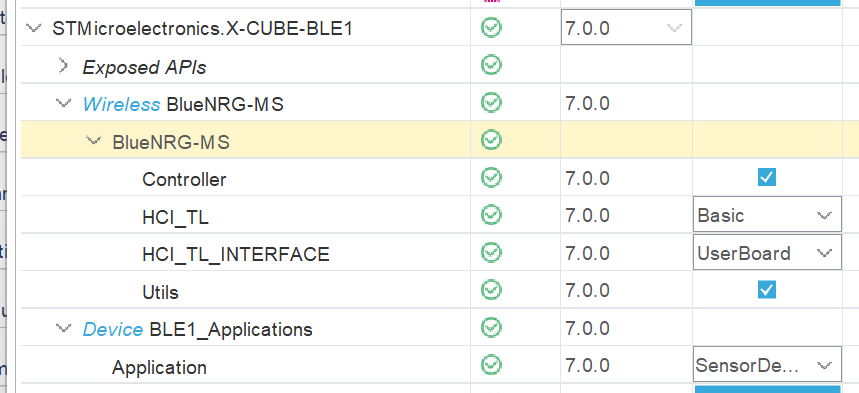
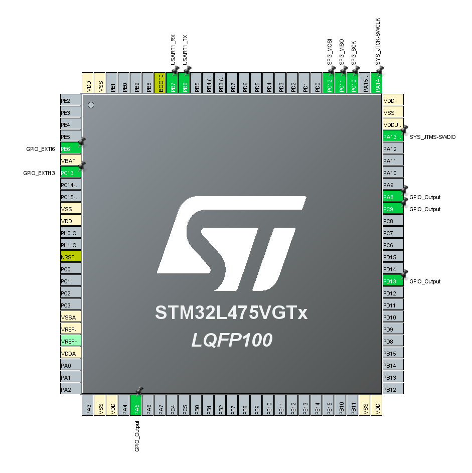
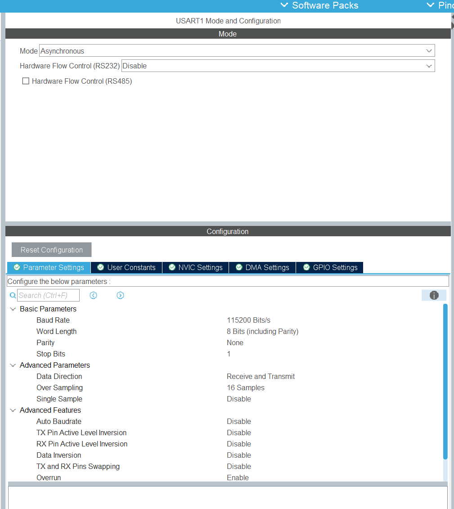
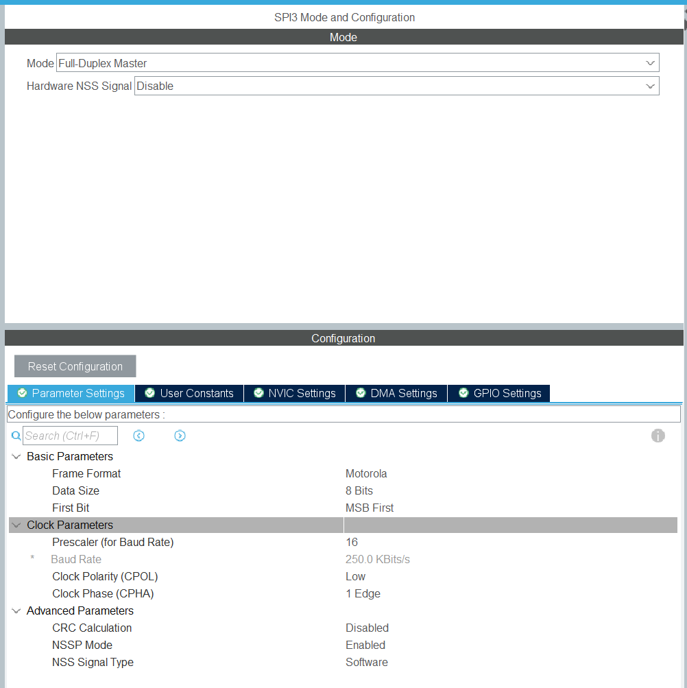
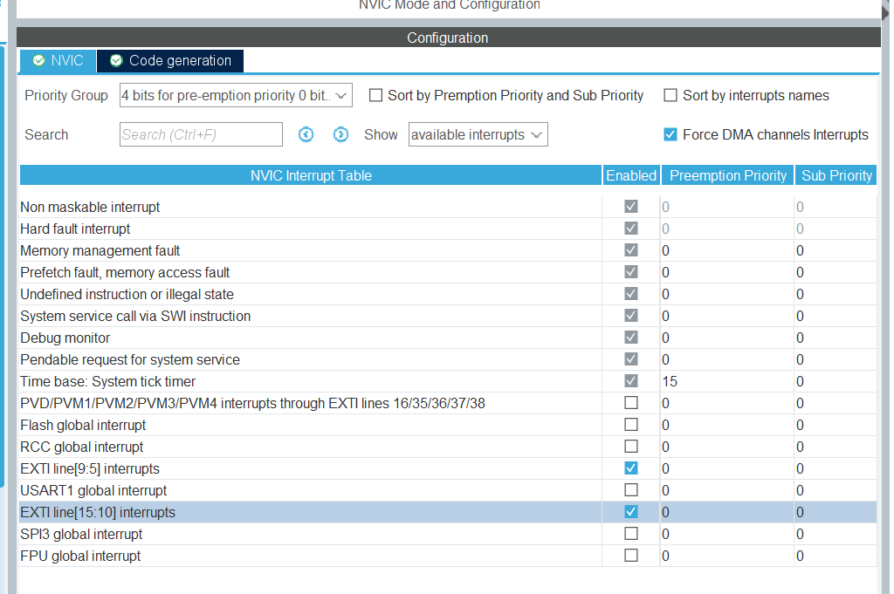
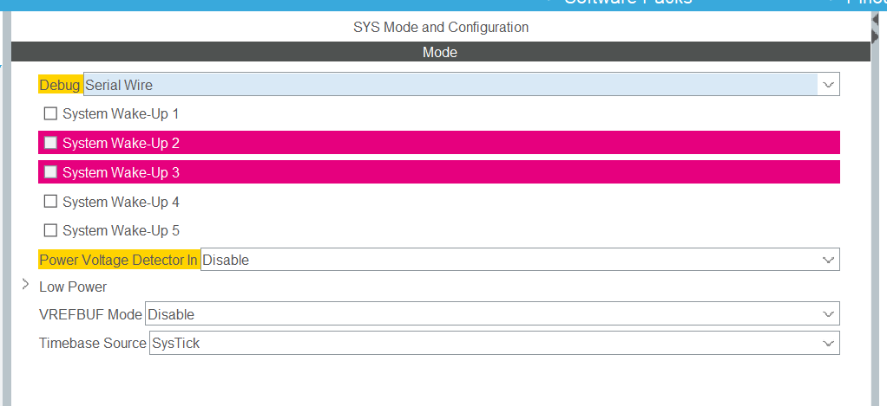
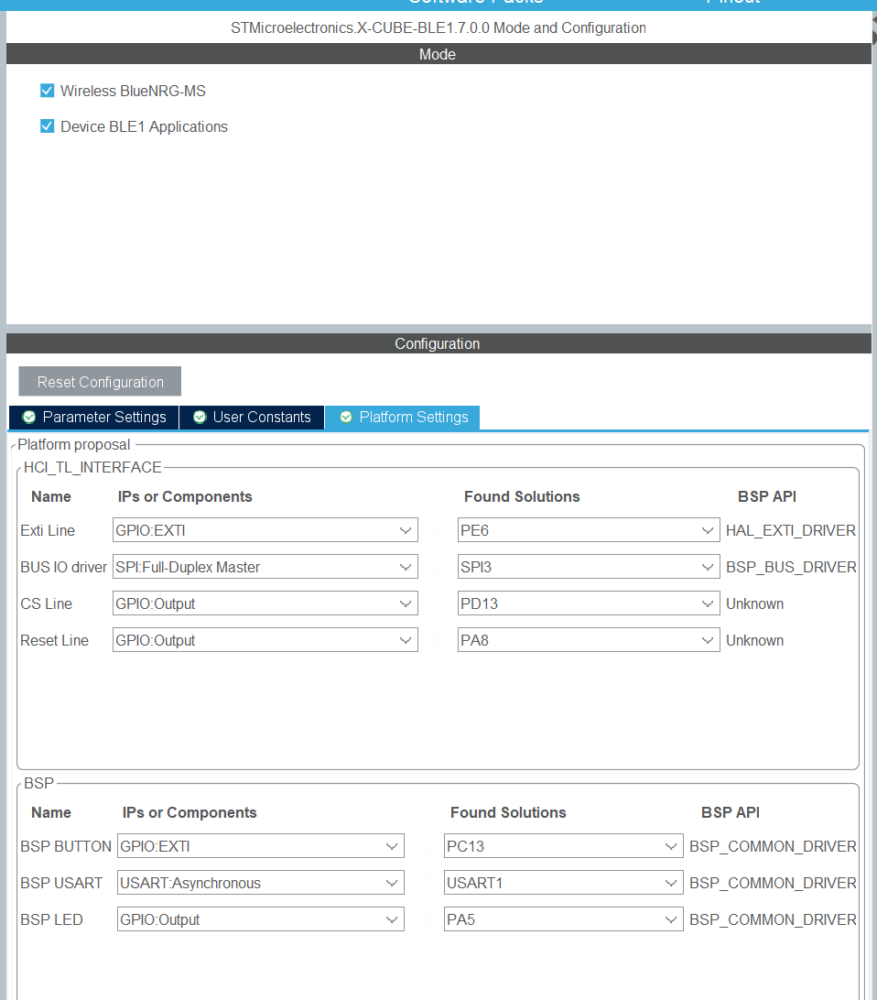
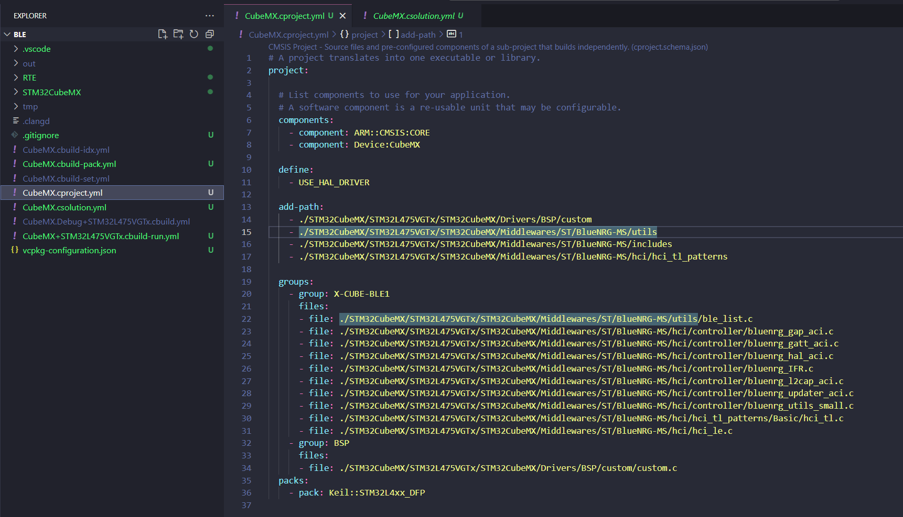
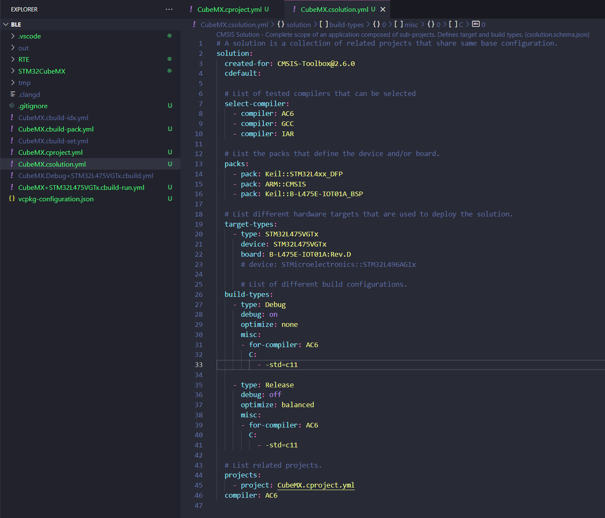

# Bluetooth Low Energy (BLE)

We will enable the Bluetooth module in this lab exercise.

We will use the ST's software pack to send sensor data to an Android device through the Bluetooth connection.

## Step 1: Install the BLE Software Package

Install the BLE Software Package as follows:

## Step 2: Configure Peripherals for Communication

Configure the peripherals as follows:

### Configure Connection Parameters

- **USART1:**

  

- **SPI3:**

  

- **EXTI:**

  

- **SYS:**

  

## Step 3: Configure BLE Software Components

Configure the BLE Software Components as follows:

## Step 4: Generate Code and Update Configuration Files

Press **Generate Code** and move to the CMSIS Solution. Although everything is ready now, CMSIS Solution doesn't automatically add the middleware software that was added in CubeMX. You will need to add those files in your `cproject.yml` file and edit the `csolution.yml` file accordingly:

## Step 5: Build, Flash, and Test

- **Build and flash** the project to your board.
- After the project is flashed, you will see the **bluelight** on your board indicating that Bluetooth is enabled successfully.
- Install **ST BLE Sensor** on your Android device and connect to your ST Board.
- Once connected, the green LED on your board will blink.
- Open the **Textual Monitor** on the app to read the sensor data from the device.
